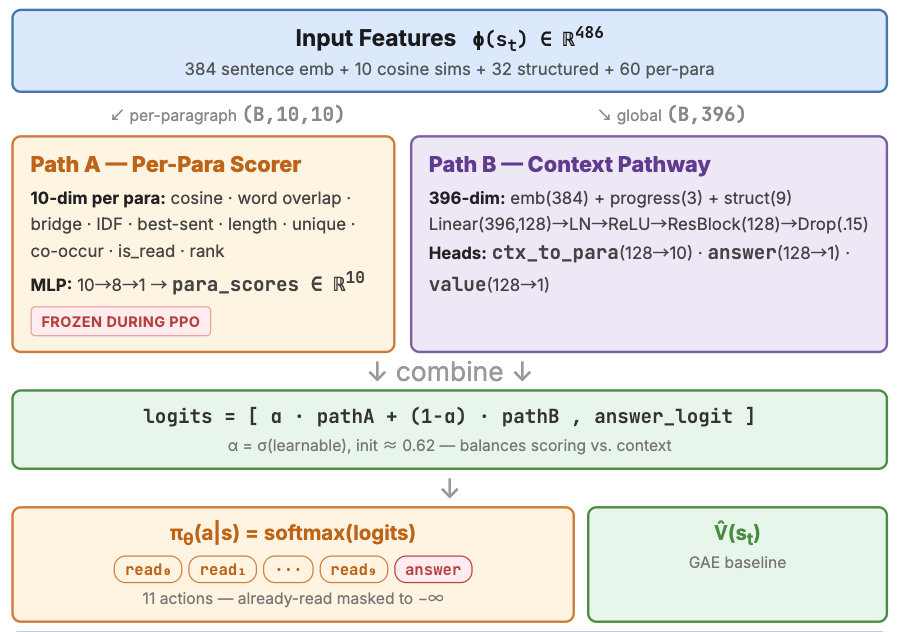
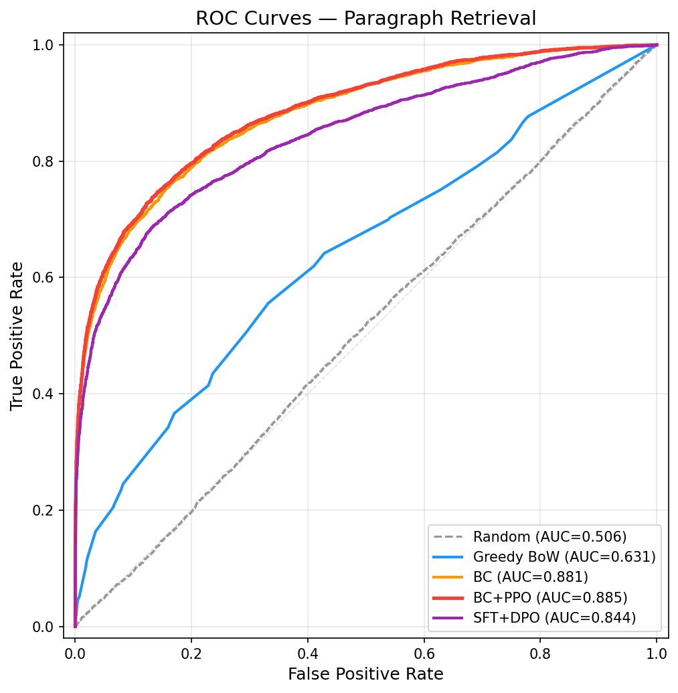
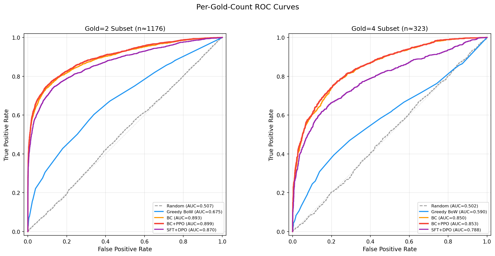
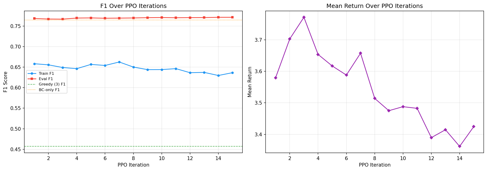
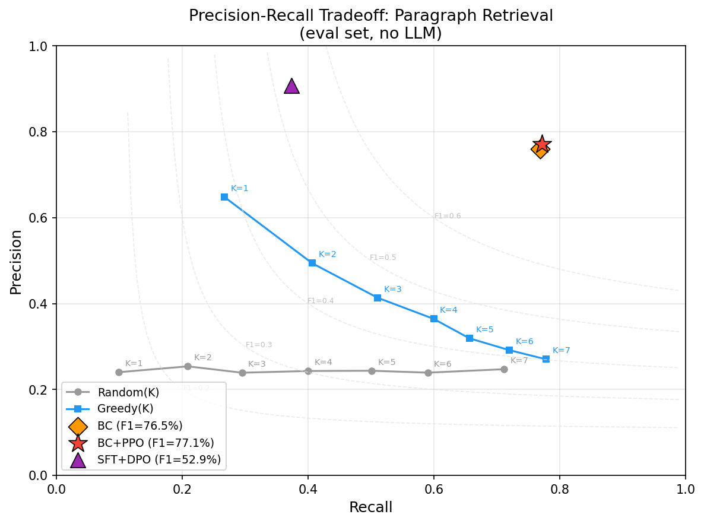
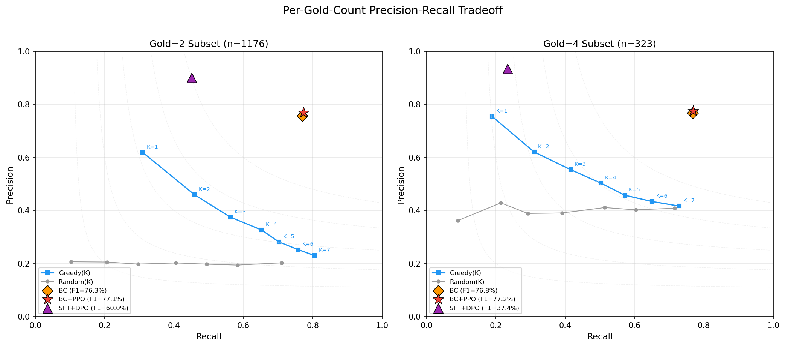
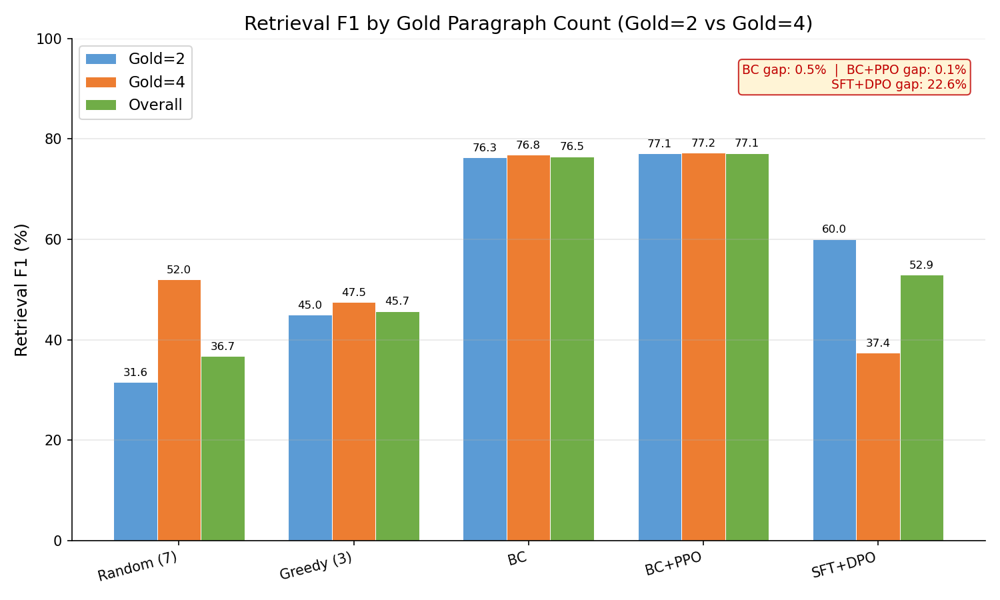
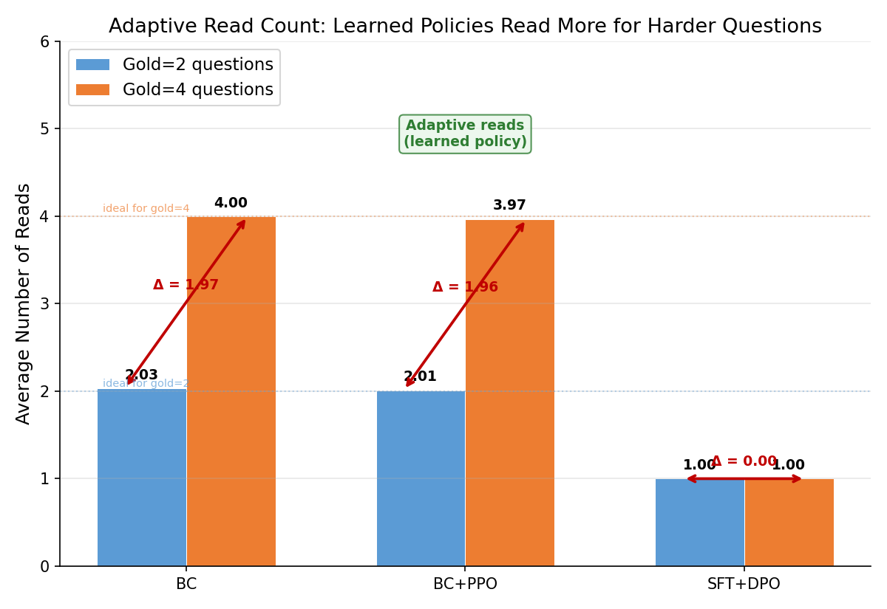

# RL for Multi-Hop QA Paragraph Retrieval

CS234 Final Project — Learning sequential paragraph retrieval policies for multi-hop question answering via Behavioral Cloning (BC), Proximal Policy Optimization (PPO), and Direct Preference Optimization (DPO).

## Table of Contents

1. [Overview](#overview)
2. [Model Architecture](#model-architecture)
3. [Method](#method)
4. [Training](#training)
5. [Results](#results)
6. [LLM Evaluation](#llm-evaluation)
7. [Zero-Shot Transfer](#zero-shot-transfer)
8. [File Structure](#file-structure)
9. [How to Run](#how-to-run)

---

## Overview

Multi-hop question answering requires reasoning over multiple documents. Given a question and 10 candidate paragraphs (a mix of gold supporting paragraphs and distractors), our system learns a **sequential retrieval policy** that decides which paragraphs to read and when to stop, before handing selected context to an LLM for answer generation.

We compare three RL approaches:
- **Behavioral Cloning (BC)**: Supervised imitation of oracle demonstrations
- **BC + PPO**: On-policy fine-tuning with dense retrieval rewards
- **SFT + DPO**: Offline preference optimization from ranked trajectory pairs

All training uses retrieval-only signals (no LLM calls). Final evaluation uses Qwen3-8B via Ollama to measure end-to-end answer accuracy.

### Dataset

We use **2WikiMultiHopQA** (compositional subset) in **blind mode** — all paragraph titles are anonymized to `Para_0` ... `Para_9` to prevent title-based shortcuts. Each question has 2 or 4 gold supporting paragraphs out of 10 candidates.

| Split | Size | Purpose |
|---|---|---|
| BC Train | 2,249 | Behavioral cloning supervision |
| BC Dev | 449 | BC early stopping |
| PPO/DPO Train | 4,499 | On-policy rollouts / preference pairs |
| Eval | 1,499 | Held-out retrieval evaluation |

---

## Model Architecture



**RetrievalSelector** — a dual-path MLP (~200K parameters) that outputs a distribution over 11 actions (`read_0` ... `read_9`, `answer`):

- **Input** $\phi(s_t) \in \mathbb{R}^{486}$: 384-dim sentence embedding (all-MiniLM-L6-v2) + 10 cosine similarities + 32 structured features + 60 per-paragraph features
- **Path A** (Per-Paragraph Scorer): Per-paragraph features $(B, 10, 10) \to$ MLP $\to$ `para_scores` $\in \mathbb{R}^{10}$. Frozen during PPO.
- **Path B** (Context Pathway): Global features $(B, 396) \to$ Linear $\to$ LayerNorm $\to$ ReLU $\to$ ResBlock $\to$ Dropout(0.15) $\to$ three heads: `ctx_to_para` $(128 \to 10)$, `answer` $(128 \to 1)$, `value` $(128 \to 1)$
- **Combined**: $\text{logits} = [\alpha \cdot \text{pathA} + (1-\alpha) \cdot \text{pathB},\; \ell_{\text{ans}}]$ where $\alpha = \sigma(\text{learnable})$, init $\approx 0.62$
- **Output**: $\pi_\theta(a|s) = \text{softmax}(\text{logits})$ with already-read paragraphs masked to $-\infty$; $\hat{V}(s_t)$ for GAE baseline

---

## Method

### Behavioral Cloning (BC)

Supervised cross-entropy loss on oracle demonstrations. At each state, the oracle selects the gold paragraph with the highest per-paragraph score (or `answer` when all golds are read). Early stopping on BC Dev F1 (patience = 5).

### PPO Fine-Tuning

Starting from BC weights, fine-tune with PPO using dense per-step rewards.

**Reward function:** At each step $t$, the environment reward is:

| Reward Component | Value | Description |
|---|---|---|
| Read gold paragraph | +1.0 | Primary incentive to find supporting evidence |
| Read distractor | −0.2 | Makes random reads negative EV |
| Step cost | −0.08 | Penalizes unnecessary reads |
| Order bonus | +0.1 | Gold read in dataset reasoning order |
| Bridge entity bonus | +0.15 | Multi-hop bridge paragraph reading |
| Answer (stop) | $1.0 \cdot F_1 + 1.5 \cdot \mathbb{1}[\text{recall}=1]$ | F1-based reward + completion bonus |

**PPO objective:** The clipped surrogate objective with value function and entropy bonus:

$$\mathcal{L} = -\mathbb{E}_t\Big[\min\big(r_t(\theta)\hat{A}_t,\; \text{clip}(r_t(\theta), 1\pm\epsilon)\hat{A}_t\big)\Big] + 0.5\,\mathcal{L}_{\text{value}} - 0.02\,H[\pi_\theta] + \alpha_{\text{KL}}\,D_{\text{KL}}(\pi_\theta \| \pi_{\text{BC}})$$

where $r_t(\theta) = \pi_\theta(a_t|s_t) / \pi_{\text{old}}(a_t|s_t)$, $\hat{A}_t$ is the GAE advantage estimate with $\gamma=0.99$, $\lambda=0.95$, and $\epsilon=0.2$.

**KL regularization:** A KL penalty $D_{\text{KL}}(\pi_\theta \| \pi_{\text{BC}})$ keeps the policy close to the BC reference. The coefficient $\alpha_{\text{KL}}$ is adaptively tuned to maintain KL in $[0.1, 0.4]$:
- If KL $> 0.4$: $\alpha_{\text{KL}} \leftarrow \min(0.3,\; 2\alpha_{\text{KL}})$
- If KL $< 0.1$: $\alpha_{\text{KL}} \leftarrow \max(0.005,\; 0.8\alpha_{\text{KL}})$

**Potential-based reward shaping** (Ng et al. 1999): A learned potential function $\Phi(s) \in [0, 1]$ predicts the expected final recall from state $s$. Starting from iteration 3, the shaped reward is:

$$R'(s_t, a_t, s_{t+1}) = R(s_t, a_t, s_{t+1}) + \alpha_{\text{shape}} \big(\gamma \Phi(s_{t+1}) - \Phi(s_t)\big)$$

where $\alpha_{\text{shape}} = \min(0.2,\; 0.1 \cdot (i - 1))$ ramps linearly from 0 to 0.2 over training iterations $i$. Potential-based shaping preserves the optimal policy while providing denser learning signal.

**Additional details:** Path A (per-paragraph scorer) is frozen during PPO, 4 epochs per update with early stopping if approx KL exceeds 0.05, gradient clipping at norm 1.0, value function also clipped.

### Supervised Fine-Tuning + Direct Preference Optimization (SFT + DPO)

As a comparison method, we train a policy using a classical offline preference learning approach:

**SFT warm-start phase:**
- Train the policy on oracle trajectories using supervised cross-entropy loss (identical to BC)
- This provides a strong initialization (the BC model) before preference learning

**DPO fine-tuning phase:**
- Starting from BC weights, use the frozen BC model as the reference policy $\pi_{\text{ref}}$
- Construct preference pairs from oracle trajectories on the BC training set (2,249 examples):
  - **Read preferences**: At each decision state along the oracle trajectory, the oracle's chosen gold paragraph is the *winning* action, paired against each available distractor as the *losing* action
  - **Stop preferences**: After all gold paragraphs are read, `answer` is the *winning* action, paired against each remaining distractor
- This generates a large set of (state, chosen, rejected) tuples with already-read paragraphs masked
- Train with the DPO loss:

$$\mathcal{L}_{\text{DPO}} = -\log \sigma\!\Big(\beta \big(\log \pi_\theta(a_w|s) - \log \pi_{\text{ref}}(a_w|s) - \log \pi_\theta(a_l|s) + \log \pi_{\text{ref}}(a_l|s)\big)\Big)$$

- $\beta = 0.1$ (preference strength), learning rate $5 \times 10^{-5}$, batch size 32
- 15 epochs with early stopping on dev loss (patience = 5), gradient clipping at norm 1.0
- Best dev checkpoint is restored after training

**Key difference from PPO:** SFT+DPO is an off-policy preference learning approach that directly compares oracle vs. distractor actions at each state, while PPO is an on-policy policy gradient method that uses dense shaped rewards. DPO avoids reward engineering entirely but operates on fixed oracle trajectories without exploring the environment.

**Failure mode:** DPO has a fundamental limitation in this multi-step setting. The preference pairs teach the shared `answer_head` to prefer stopping over reading distractors, but cannot distinguish "read 1 of 2 golds" from "read 2 of 2 golds" — the state features after reading any single gold paragraph are similar enough that the stop signal over-generalizes. The resulting policy reads exactly 1 paragraph then stops (P=90.8%, R=37.3%, F1=52.9%), despite having strong per-paragraph ranking ability (ROC AUC = 0.844). This illustrates that offline preference methods struggle with sequential decision-making where the value of stopping depends on trajectory history.

---

## Training

### Hyperparameters

| Parameter | Value |
|---|---|
| Sentence encoder | all-MiniLM-L6-v2 (384-dim) |
| Feature dimension | 486 |
| Learning rate (BC / PPO) | 3 × 10⁻⁵ |
| Learning rate (DPO) | 5 × 10⁻⁵ |
| PPO iterations | 15 (patience = 6) |
| PPO epochs per update | 4 |
| Discount $\gamma$ | 0.99 |
| GAE $\lambda$ | 0.95 |
| Clip $\epsilon$ | 0.2 |
| Entropy coefficient | 0.02 |
| DPO $\beta$ | 0.1 |
| DPO epochs | 15 (patience = 5) |
| DPO batch size | 32 |
| Budget K | 5 |
| Seed | 42 |

---

## Results

### Retrieval Performance (1,499 Eval Questions, Blind Mode)

| Strategy | Precision | Recall | F1 | Avg Reads |
|---|---|---|---|---|
| Best Greedy (K=3) | 41.4% | 51.0% | 45.7% | 3.0 |
| SFT + DPO | 90.8% | 37.3% | 52.9% | 1.0 |
| BC | 76.1% | 76.9% | 76.5% | 2.5 |
| **BC + PPO** | **77.1%** | **77.2%** | **77.1%** | **2.4** |

### ROC Analysis (Step-0 Paragraph Ranking)

ROC curves evaluate each model's ability to **rank gold paragraphs above distractors at the first decision step** (before any paragraph is read). The AUC measures the probability that a randomly chosen gold paragraph receives a higher score than a randomly chosen distractor.

| Model | AUC |
|---|---|
| Random | 0.506 |
| Greedy (BoW) | 0.631 |
| SFT + DPO | 0.844 |
| BC | 0.881 |
| BC + PPO | 0.885 |

| | | |
|:---:|:---:|:---:|
|  |  |  |
| ROC Curve (All) | ROC by Gold Count | PPO Training Curve |

### Precision-Recall Analysis

Unlike ROC (which measures single-step ranking), Precision-Recall evaluates the **full multi-step trajectory outcome** — of the paragraphs the policy chose to read before stopping, what fraction were gold (precision) and what fraction of all golds were found (recall). A model can have high ROC AUC but poor PR if its stopping policy is suboptimal — SFT+DPO exemplifies this (AUC=0.844 but F1=52.9% due to always stopping after 1 read).

| | | |
|:---:|:---:|:---:|
|  |  | |
| Precision-Recall (All) | PR by Gold Count | |

### Adaptive Reading & Per-Group Performance

The learned policies dynamically adjust read count based on question difficulty:

| Strategy | Gold=2 Reads | Gold=4 Reads | Adaptive? |
|---|---|---|---|
| Greedy (K) | K | K | No |
| BC | 2.03 | 4.00 | Yes |
| **BC + PPO** | **2.01** | **3.97** | **Yes** |

| | |
|:---:|:---:|
|  |  |
| F1 by Gold Count | Adaptive Read Count |

### Statistical Significance (Paired Permutation, 10K Permutations)

| Comparison | F1 (A) | F1 (B) | p-value |
|---|---|---|---|
| BC+PPO vs BC | 77.1% | 76.5% | 0.018 \* |
| SFT+DPO vs BC | 52.9% | 76.5% | 1.000 |

> **Note on SFT+DPO p-value:** This is a one-sided test (H₁: A > B). Since SFT+DPO F1 is *lower* than BC, the test correctly returns p=1.0 — the evidence is entirely in the opposite direction. A two-sided test would reject the null (SFT+DPO is significantly *worse* than BC).

---

## LLM Evaluation

End-to-end evaluation using Qwen3-8B (via Ollama) on **60 hard questions** pre-filtered to exclude questions the LLM can answer without context. Answer accuracy scored via cascaded exact-match, substring containment, and LLM-as-judge.

### LLM Downstream Performance (2WikiMultiHopQA, 60 Hard Questions)

| Strategy | Answer Acc | Retrieval F1 | Reads |
|---|---|---|---|
| Best Greedy | 58% | 40.2% | 3.0 |
| SFT + DPO | 53% | 51.7% | 1.0 |
| BC | 67% | 74.8% | 2.5 |
| **BC + PPO** | **73%** | **75.6%** | **2.3** |

> **Note:** Retrieval F1 here is computed on the 60-question pre-filtered subset, not the full 1,499-question eval set. Values will differ from the main retrieval results table above.

BC + PPO achieves the highest answer accuracy (+6% over BC, +15% over Best Greedy) while maintaining the best retrieval F1 and fewest reads.

---

## Zero-Shot Transfer

To test generalization, we apply the models trained on 2WikiMultiHopQA directly to **HotpotQA** without any fine-tuning, evaluating on 60 pre-filtered hard questions.

### Zero-Shot Transfer (2WikiMultiHopQA → HotpotQA, 60 Hard Questions)

| Strategy | HotpotQA F1 | 2Wiki F1 | Δ |
|---|---|---|---|
| Best Greedy | 39.5% | 40.2% | −0.7% |
| SFT + DPO | 38.3% | 51.7% | −13.4% |
| BC | 59.8% | 74.8% | −15.0% |
| **BC + PPO** | **61.2%** | **75.6%** | **−14.4%** |

> **Note:** 2Wiki F1 is the same Retrieval F1 from the LLM Downstream table above (same 60-question subset). HotpotQA uses a separate set of 60 pre-filtered hard questions.

Key findings:
- **BC + PPO retains the highest absolute F1 on HotpotQA** (61.2%), confirming generalization
- All learned policies degrade on transfer (Δ ≈ −13–15%), while Best Greedy's BoW heuristic is nearly dataset-agnostic (Δ = −0.7%)
- DPO's over-stopping pathology (always reading 1 paragraph) hurts more on the new domain, dropping retrieval F1 from 51.7% to 38.3%

---

## File Structure

```
.
├── train_only.py            # BC + PPO training (no LLM required)
├── train_dpo.py             # SFT + DPO training + ROC curves + significance tests
├── eval_llm.py              # Unified LLM evaluation (2Wiki + HotpotQA transfer)
├── ppo_finetuner.py         # RetrievalSelector, PPOFineTuner, TaskScorer, rewards
├── hotpot_pipeline.py       # Data loading, blind mode, pre-filtering, baselines
├── multi_agent_baseline.py  # RetrievalAgent (LLM interface), trajectory structs
├── plot_results.py          # Generate all visualization plots from train_metrics.json
├── plot_architecture.py     # Generate model architecture figure
├── run_modal.py             # Modal cloud deployment (optional, GPU)
├── requirements.txt         # Python dependencies
├── model_architecture.png   # Architecture diagram
├── checkpoints_blind/       # Saved models & training artifacts
│   ├── split.json           #   Data splits
│   ├── bc_model.pt          #   BC model weights
│   ├── ppo_best.pt          #   Best PPO model weights
│   ├── sft_dpo_model.pt     #   SFT+DPO model weights
│   ├── train_metrics.json   #   All training metrics, ROC data, significance tests
│   └── *.png / *.csv        #   Training curves and plots
└── results/                 # LLM evaluation outputs
    ├── llm_eval_report.txt  #   Formatted evaluation tables
    └── llm_eval_results.json #  Machine-readable results
```

---

## How to Run

### Prerequisites

- Python 3.10+
- [Ollama](https://ollama.ai/) with `qwen3:8b` (for LLM evaluation only)

### Setup

```bash
pip install -r requirements.txt

# For LLM evaluation only:
ollama pull qwen3:8b
```

### Training

```bash
# Train BC + PPO (no LLM needed)
python train_only.py              # full run (~30 min CPU)
python train_only.py --small      # quick test (~2 min)

# Train SFT + DPO + generate ROC curves
python train_dpo.py

# Regenerate plots from saved metrics
python plot_results.py
```

### LLM Evaluation

```bash
# Full evaluation: 60 hard questions x 2 datasets (requires Ollama)
python eval_llm.py

# Quick test: 20 questions x 2 datasets
python eval_llm.py --small
```

### Cloud Deployment (Optional)

```bash
pip install modal && modal setup

# Run LLM eval on Modal (GPU: A10G)
modal run run_modal.py::run_eval
modal run run_modal.py::run_eval --small
```
